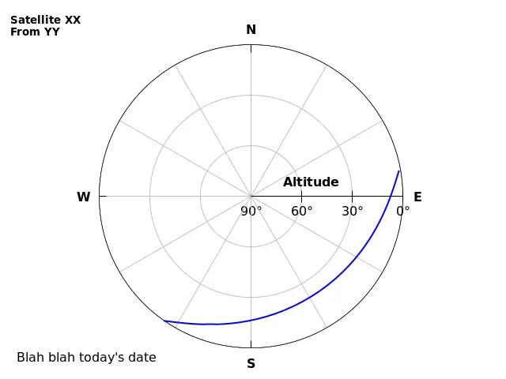

# tleservice

TLEService is a microservice for calculating satellite orbits.

This is not an official Google product.

## Intro

[TLE][tle] is a data format for describing something that orbits the Earth.

It's then up to the user of the TLE data to turn this into "well, where is the
object right now?"

## Howto

### Building

```
go install google.golang.org/protobuf/cmd/protoc-gen-go@v1.28
go install google.golang.org/grpc/cmd/protoc-gen-go-grpc@v1.2
# install protoc-gen-grpc-web from https://github.com/grpc/grpc-web/releases
./genprotos.sh
```

Start the server:

```
$ go run ./cmd/tleserver/
```

Example client gets the lat/long/alt of the ISS in the next 10 minutes:

(the TLE data for the ISS is currently hardcoded in the client)

```
$ ./tleclient  | tee orbit.dat

[… lots of data …]
$ ./plot/orbit.plot
$ ./plot/altitude.plot
```


And with some simple processing:




## Use cases

* Schedule and aim communication with satellites, such as the amateur radio
  repeaters on the ISS.
* Know where in the sky to look, and when, to see the ISS go by.
* Make beautiful 2D and 3D plots of orbits.


[tle]: https://en.wikipedia.org/wiki/Two-line_element_set
